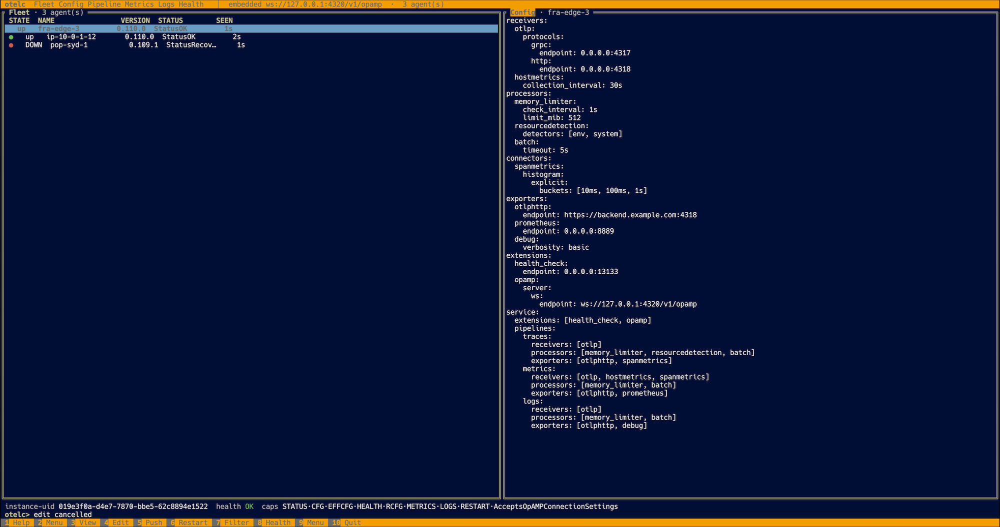

# otelc

You may now Norton Commander, but do you know OTel Commander? As a
infra or platform engineer, SRE, devops, you oftentimes need to deploy,
scale, and troubleshoot a fleet of OpenTelemetry collectors. The OTel Commander
`otelc` helps you to do this. It connects over Open Agent Management Protocol
(OpAMP) to OTel collectors, allowing you to view, edit, visualize their
configuration and get health insights incl. metrics and logs:




See [`docs/design/mockups.md`](docs/design/mockups.md) for all screens.

## Status

Working prototype covering: The embedded OpAMP server, the OTLP receiver, collector config push, restart, and the pipeline graph all work end-to-end. See [`docs/design/`](docs/design/) for the design and the roadmap including component-level edits and probing (think OTTL), config diff, TLS/mTLS, and a concrete external-server adapter.

## Build

To build the tool, you need a stable Rust toolchain and `protoc` (the protobuf compiler, used by
`prost-build`; the OpAMP `.proto` itself is vendored under `proto/`).

To install `protoc`, do:

```sh
# Debian/Ubuntu:
apt-get install -y protobuf-compiler

# macOS:
brew install protobuf
```

Then you can build as follows:

```sh
cargo build --release
```

## Run

`otelc` runs an embedded OpAMP server by default. Collectors or their
OpAMP supervisors connect to it.

```sh
otelc # OpAMP on ws://127.0.0.1:4320, OTLP on :4317
otelc --listen 0.0.0.0:4320 --otlp-listen 0.0.0.0:4317
otelc --config otelc.example.yaml
otelc --mode external --external-url http://my-opamp-server:8080
```

### Try it without a real collector

The `mock-agent` example simulates a fleet of OpenTelemetry Collectors — they
connect over OpAMP, report a realistic multi-pipeline config and health, apply
remote-config offers, honor restart commands, and push OTLP own-telemetry.

In one terminal:

```sh
cargo run --release --bin otelc
```

In another:

```sh
cargo run --release --bin mock-agent -- --count 3
```

The three agents appear in the Fleet panel. Press `Tab` to focus the right
panel, `1`–`6` to switch its view (Fleet / Config / Pipeline / Metrics / Logs /
Health), `F4` to edit an agent's config and `F5` to push it, `F6` to restart an
agent, `F1` for help, `F10` to quit.

### Use a real OpAMP Supervisor

Point an [OpAMP Supervisor](https://github.com/open-telemetry/opentelemetry-collector-contrib/tree/main/cmd/opampsupervisor)
at the embedded server by setting, in `supervisor.yaml`:

```yaml
server:
  endpoint: ws://127.0.0.1:4320/v1/opamp
capabilities:
  accepts_remote_config: true
  reports_own_metrics: true
  reports_own_logs: true
```

## Project layout

```
crates/otelc-opamp   OpAMP wire types, WebSocket framing, embedded OpAMP server
crates/otelc-otlp    Embedded OTLP/gRPC receiver + bounded telemetry store
crates/otelc-tui     The `otelc` binary: Norton Commander TUI + ControlPlane
examples/mock-agent  Simulated collector fleet for end-to-end testing
proto/               Vendored OpAMP protobuf schema
docs/design/         High-level design, detailed design, UI mockups
```

## Test

```sh
cargo test --workspace      # framing, OpAMP server round-trip, store, pipeline parser
cargo clippy --workspace
```

## License

MIT — see [LICENSE](LICENSE).
